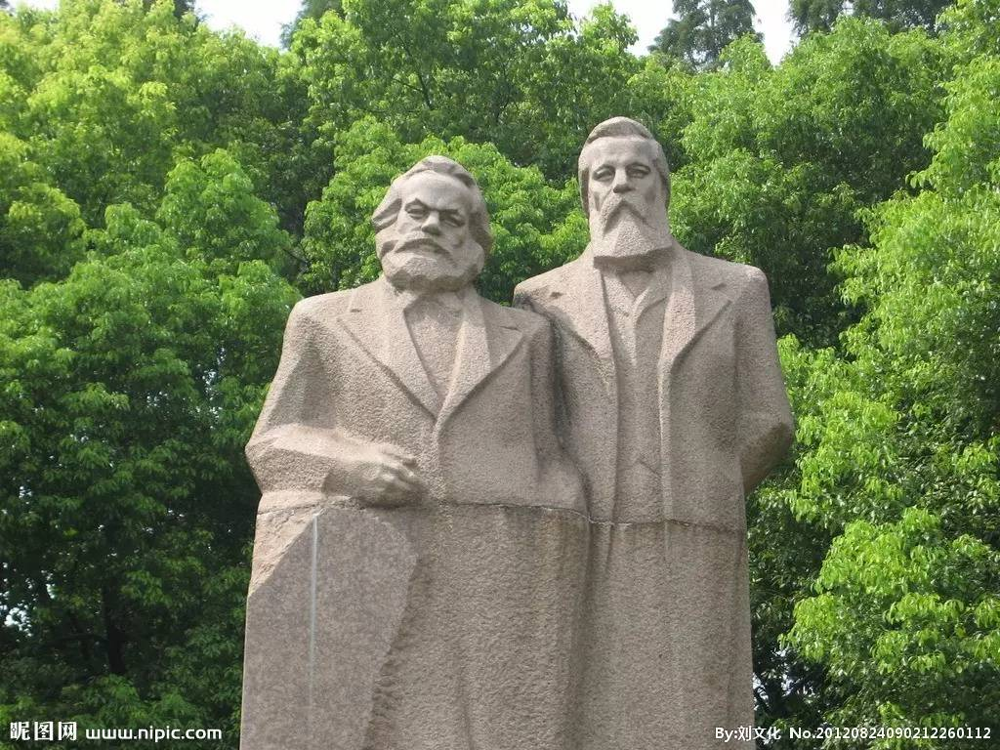
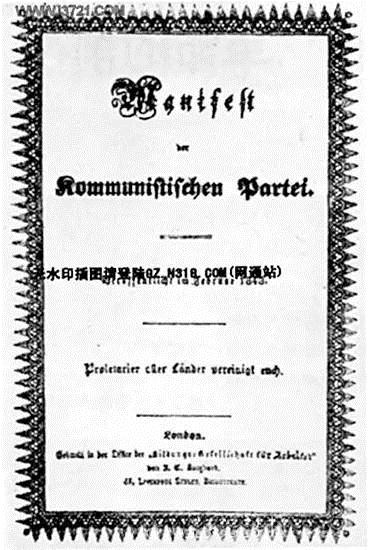
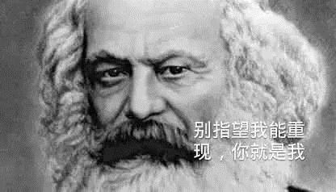

# 《共产党宣言》全文 

《共产党宣言》全文

卡•马克思 弗•恩格斯

1847年12月—1848年1月

英文：The Communist Manifesto

(Manifesto of the Communist Party)

德文：Manifest der Kommunistischen Partei

# 引言

一个幽灵，共产主义的幽灵，在欧洲游荡。为了对这个幽灵进行神圣的围剿，旧欧洲的一切势力：教皇和沙皇、梅特涅和基佐、法国的激进派和德国的警察，都联合起来了。

**有哪一个反对党不被它的当政的敌人骂为共产党呢？又有哪一个反对党不拿共产主义这个罪名去回敬更进步的反对党人和自己的反动敌人呢？**

从这一事实中可以得出两个结论：

共产主义已经被欧洲的一切势力公认为一种势力；

现在是共产党人向全世界公开说明自己的观点、自己的目的、自己的意图并且拿出自己党的宣言来批驳关于共产主义幽灵的神话的时候了。

为了这个目的，各国共产党人集会于伦敦，拟定了如下的宣言，用英文、法文、德文、意大利文、弗拉芒文和丹麦文公布于世。

# 一、资产者和无产者⑴

**至今一切社会的历史⑵都是阶级斗争的历史。**

自由民和奴隶、贵族和平民、领主和农奴、行会师傅⑶和帮工，一句话，**压迫者和被压迫者，始终处于相互对立的地位，进行不断的、有时隐蔽有时公开的斗争**，而每一次斗争的结局，或是整个社会受到革命改造，或是斗争的各阶级同归于尽。

在过去的各个历史时代，无论何处我们都可以看到社会被划分为各个不同的阶级，社会地位分成多种多样的等级。在古罗马，有贵族、骑士、平民、奴隶，在中世纪，有封建主、臣仆、行会师傅、帮工、农奴，而且几乎在每一个阶级内部又有一些特殊的等级。

从封建社会的灭亡中产生出来的现代资产阶级社会并没有消灭阶级对立。它只不过是用新的阶级、新的压迫条件、新的斗争形式代替了旧的。

但是，我们现在这个时代，资产阶级时代，却有一个特点：它使阶级对立简单化了。整个社会日益分裂为两大敌对的阵营，分裂为两大相互直接对立的阶级：**资产阶级和无产阶级**。

从中世纪的农奴中产生了初期城市的市民（自由民）；从这个市民等级中发展出最初的资产阶级分子。

美洲和绕过非洲的航海线路的发现，给新兴的资产阶级开辟了新天地。东印度和中国的市场、美洲的殖民化、对殖民地的贸易、交换手段和一般商品的增加，使商业、航海业和工业空前高涨，因而促使正在崩溃的封建社会内部的革命因素得到迅速的发展。

以前那种封建的或行会的工业经营方式，已经不能满足随着新市场的出现而增加的需求了。工场手工业代替了这种经营方式。行会师傅被工业的中间等级排挤掉；各种行业组织之间的分工随着各个作坊内部的分工的出现而消失。

但是，市场总是在扩大，需求总是在增加。甚至工场手工业也再不能满足需要。于是，蒸汽和机器引起了工业生产的革命。现代大工业化代替了工场手工业；工业中的百万富翁，一支一支产业大军的首领，现代资产者，代替工业的中间等级占据的重要位置。

由于美洲的发现，促使大工业建立起早已准备好的世界市场。世界市场使商业、航海业和陆路交通得到了巨大的发展，这种发展反过来又促进了工业的扩展，同时，随着工业、商业、航海业和铁路的扩展，资产阶级也得到在同一程度上的发展，资本的增加，把中世纪遗留下来的一切阶级都尽情地排挤掉。

由此可见，**现代资产阶级本身是一个长期发展过程的产物，是生产方式和交换方式的一系列变革的产物。**

资产阶级每一个阶段的这种发展，都伴随着在政治上取得相应的进展。它在封建主统治下也是被压迫的阶级，在**公社**⑷里是武装的和自治的团体，在一些地方组成**独立的城市共和国**（如德国和意大利），在另一些地方组成**君主国中的纳税的第三等级**（如法国）⑸；后来，在工场手工业时期，它是等级制君主国或专制君主国用以同贵族抗衡的势力，而且是大君主国的主要基础；最后，从大工业和世界市场建立的时候起，它在现代的代议制国家里夺得了**独占的政治统治权力**。**现代的国家政权只不过是管理整个资产阶级的共同事务的一个委员会**罢了。

**资产阶级在历史上，也曾经起过非常革命的作用。**

资产阶级，在它已经取得统治的地方，把一切封建的、宗法的和田园诗般的关系都破坏了。它无情地斩断了“传统”的形形色色的封建礼教束缚人们的羁绊，它使人和人之间除了赤裸裸的利害关系和冷酷无情的“现金交易”，就再也没有任何别的联系。它把人们对宗教的虔诚、骑士的热忱血性和小市民的伤感温情这些情感的爆发，淹没在一切都为自己打算的冰水之中。把人的尊严变成了交换价值，把无数特许的和自力挣得的自由用一种没有良心的贸易自由代替。总而言之，**它用赤裸裸的、公开的、无耻的、直接的、露骨的和残忍的剥削代替了由宗教和政治带着欺骗的假面具掩盖着的剥削。**

资产阶级，抹去了一切素来受人尊崇和令人敬畏的职业的神圣光环。它把医生、律师、教士、诗人和科学家变成了它出钱雇佣的仆役。

资产阶级，撕下了罩在家庭关系上的温情脉脉的面纱，把这种关系变成了纯粹的金钱关系。

资产阶级，揭示了深受保守派赞许的那种中世纪崇尚人力的野蛮勇武行为，是和极端的怠惰因循习气相辅相成。它首次证明了，人的活动能够取得什么样的成就。它创造了完全不同于埃及金字塔、罗马水道和哥特式教堂的奇迹；它完成了完全不同于民族大迁徙和十字军东征的远征。

资产阶级如果不是对生产工具进行变革，进而对生产关系，直至对全部社会关系不断地进行革命，就不能生存下去。反之，过去的一切工业阶级生存的首要条件，就是要原封不动地保持旧的生产方式。**生产的不断变革，一切社会状况不停的动荡，永远的不安定和变动，这就是资产阶级时代不同于过去一切时代的地方。**一切固定的僵化的关系以及与之相适应的素被尊崇的观念和见解都被消除了，一切新形成的关系等不到固定下来就陈旧了。一切等级的和固定的东西都烟消云散了，一切神圣的东西都被亵渎了。人们终于不得不用冷静的眼光来看他们的生活地位、他们的相互关系。

由于不断扩大产品销路的需要，驱使资产阶级奔走于全球各地。它必须到处落户，到处开发，到处建立联系。

资产阶级由于开拓了世界市场，使一切国家的**生产和消费都成为世界性**。使反动派大为伤心惋惜的是，**资产阶级挖掉了工业脚下的民族基础**。古老的民族工业被消灭，并且每天都还在被消灭。它们被新的工业模式排挤掉了，新工业模式的建立已经成为一切文明民族生命攸关的问题；这些**工业所加工的，已经不是本地的原料，而是来自极其遥远的地区的原料；它们的产品不仅供本国消费，而且同时供世界各地消费。**旧的、靠本国产品来满足的需要，被新的、要靠极其遥远的国家和气候悬殊地带的产品来满足的需要所代替。**过去那种地方的和民族的自给自足和闭关自守状态，被各民族的各方面的互相往来和各方面的互相依赖所代替。**物质的生产是如此，精神的生产也是如此。各民族在精神活动方面的成果，已经成为共同享受的东西。民族的片面性和局限性日益变得不可能存在，于是由许多种民族的和地方的文学形成了一种世界的文学。

资产阶级，由于一切生产工具的迅速改进，由于交通的极其便利，把一切民族甚至是最野蛮的民族，都卷到文明中来。它的商品的低廉价格，就是它用来摧毁一切万里长城、征服野蛮人最顽强仇外心理的重炮。它迫使一切民族——如果它们不想灭亡的话——采用资产阶级的生产方式；它迫使它们在自己那里推行所谓文明，即变成资产者。一句话，它按照自己的形象为自己创造出一个世界。

资产阶级使农村屈服于城市的统治。它创立了巨大的城市，使城市人口比农村人口大大增加起来，因而使很大一部分居民脱离了农村生活的愚昧状态。正象它使农村从属于城市一样，它使未开化和半开化的国家从属于文明的国家，使农民的民族从属于资产阶级的民族，使东方从属于西方。

**资产阶级日甚一日地消灭生产资料、财产和人口的分散状态。使人口密集起来，使生产资料集中起来，使财产聚集在少数人的手里。由此必然产生的结果就是政治的集中。**原先各自独立的、几乎只有同盟关系的、各有不同利益、不同法律、不同政府、不同关税的各个地区，现在已经结合为一个拥有**统一**的政府、**统一**的法律、**统一**的民族阶级利益和**统一**的关税的统一的“民族”。

**资产阶级在不到一百年的阶级统治中所创造的生产力，比过去一切世代所创造的全部生产力加起来还要大，还要多。**自然力的征服，机器的采用，化学在工业和农业中的应用，轮船的行驶，铁路的通行，电报的使用，整片整片大陆的开垦，河川的通航，仿佛用法术从地下呼唤出来的大量人口，——试问过去哪一个世纪能料想到在社会劳动里蕴藏有这样巨大的生产力？

由此可见，**资产阶级赖以形成的生产资料和交换手段，是在封建社会里造成的。**在这些生产资料和交换手段发展的一定阶段上，封建社会的生产和交换在其中进行的关系，封建的农业和工场手工业组织，一句话，**封建的所有制关系，就不能再同已经发展的生产力相适应。**这种生产关系已经在阻碍生产而不是促进生产。它变成了束缚生产的桎梏。它必须被打破，而且已经被打破。

取而代之的是自由竞争以及与自由竞争相适应的社会制度和政治制度、资产阶级的经济统治和政治统治。

现在，在我们眼前又进行着类似的运动。拥有资产阶级的生产关系和交换关系，资产阶级的所有制关系，这个曾经仿佛用魔术创造了如此庞大的生产资料和交换手段的现代资产阶级社会，现在像一个魔法师一样不能再支配自己用法术呼唤出来的魔鬼了。**几十年来的工业和商业的历史，只不过是现代生产力反抗现代生产关系、反抗作为资产阶级及其统治的存在条件的所有制关系的历史。**要证明这一点，只要指出在周期性的重复中越来越凶猛、越来越危及整个资产阶级社会生存的商业危机就足够了。在每次商业危机期间，总是不仅有很大一部分制成的产品被毁灭掉，而且有很大一部分已经造成的生产力同样被毁灭掉。在危机期间，发生一种在过去一切时代看来都是非常荒唐的社会瘟疫，即生产过剩的瘟疫。社会突然发现自己转瞬回到了一时的野蛮状态；仿佛是一次饥荒、一场普遍的毁灭性战争，使社会失去了全部生活资料；仿佛是工业和商业全被毁灭了，——这是什么缘故呢？因为社会上“文明”过度，生活资料“太多”，工业和商业太发达。社会所拥有的生产力已经不能再促进资产阶级文明和资产阶级所有制关系的发展；反过来说，就是**生产力已经强大到这种生产关系所不能适应的地步，生产力已经受到这种生产关系的阻碍；而生产力一着手突破这种障碍，就使整个资产阶级社会陷入混乱，就使资产阶级所有制的存在受到威胁。**资产阶级的关系已经太狭窄了，再容纳不了它本身所创造的财富。——资产阶级用什么办法来克服这种危机呢？一方面不得不消灭大量生产力，另一方面夺取新的市场，更加彻底地利用旧的市场。这究竟是怎样的一种办法呢？这不过是资产阶级准备更全面更猛烈的下一次危机的办法，不过是使防止危机的手段越来越少的办法。

**资产阶级用来推翻封建制度的武器，现在却对准资产阶级自己。**

但是，资产阶级不仅锻造了置自身于死地的武器；同时它还造就了将要运用这种武器来反对它的人——现代的工人，即**无产者**。

随着资产阶级即资本愈发展，无产阶级即现代工人阶级也在同一程度上愈得到发展；**现代的工人只有当他们找到工作的时候才能生存，并且只有当他们的劳动给资本带来增殖的时候才能找到工作。**这些不得不把自己零星出卖的工人，像其他任何货物一样，也是一种商品，所以他们同样避免不了要受到竞争的一切变化、市场的一切波动的影响。

由于机器的推广和分工，无产者的劳动已经失去了任何独立的性质，因而对工人也失去了任何吸引力。工人变成了机器的单纯的附属品，要求他做的只是极其简单、极其单调和极容易学会的操作。因此，花在工人身上的费用，几乎只限于维持工人生活和延续工人后代所必需的生活资料。但是，一切商品的价格，包括**劳动的价格**⑹，同它的生产费用相等。因此，劳动越使人感到厌恶，工资也就越减少。不仅如此，机器越推广，分工越细致，劳动量也就越增加，这或者是由于工作时间的延长，或者是由于在一定时间内所要求的劳动的增加，机器运转的加速，等等。

现代工业已经把家长式的师傅的小作坊变成了工业资本家的大工厂。挤在工厂里的工人群众就象士兵一样被组织起来。他们是产业大军的普通士兵，受着各级“军士”和“军官”的层层监视。他们不仅是资产阶级的、资产阶级国家的奴隶，并且每日每时都受机器、受监工，首先是受各个经营工厂的资本家的奴役。这种专制制度越是公开地把发财营利宣布为自己的最终目的，它就越显得可鄙、可恨和可恶。

手的操作所要求的技巧和气力越少，换句话说，现代工业越发达，男工也就越受到女工和童工的排挤。对工人阶级来说，性别和年龄的差别再没有什么社会意义。他们都只是劳动工具，不过因为年龄和性别的不同而需要不同的费用罢了。

当厂主对工人的剥削告一段落，工人领到了用现钱支付的工资的时候，马上就有资产阶级中的另一部分人——房东、小店主、当铺老板等等向他们扑来。

以前的中间等级的下层，即小工业家、小商人和小食利者，手工业者和农民——所有这些阶级都降落到无产阶级的队伍里来，有的是因为他们的小资本不足以经营大工业，经不起与较大资本家的竞争；有的是因为他们的手艺已经被新的生产方法弄得不值钱。无产阶级的队伍就是这样从居民的所有阶级中得到补充。

**无产阶级经历了各个不同的发展阶段。它反对资产阶级的斗争是和它的存在同时开始。**

最初是单个的工人，然后是某一工厂的工人，然后是某一地方的某一劳动部门的工人，同直接剥削他们的单个资产者作斗争。他们不仅仅攻击资产阶级的生产关系，而且攻击生产工具本身；他们毁坏那些来竞争的外国商品，捣毁机器，烧毁工厂，力图恢复已经失去的中世纪工人的地位。

在这个阶段上，工人们还是分散在全国各地并因为相互竞争所分裂而根本无法联合的群众。工人的大规模集结，还不是他们自己联合的结果，而是资产阶级联合的结果。当时资产阶级为了达到自己的政治目的，不得不发动并且暂时还能够把整个无产阶级发动起来。因此，在这个阶段上，无产者不是同自己的敌人作斗争，而是同自己的敌人的敌人作斗争，即同专制君主制的残余、地主、非工业资产阶级和小资产者作斗争。因此，整个历史运动都集中在资产阶级手里；在这种条件下取得的每一个胜利都是资产阶级的胜利。

但是，随着工业的发展，无产阶级不仅人数增加了，而且结合成更大的群体，它的力量日益增长，也越来越感觉到自己的力量。机器使劳动的差别越来越小，使工资几乎降到同样低的水平，因而无产阶级内部的利益和生活状况也越来越趋于一致。资产者彼此间日益加剧的竞争以及由此引起的商业危机，使工人的工资越来越不稳定；机器的日益迅速的和继续不断的改良，使工人的整个生活地位越来越没有保障；个别工人和个别资产者之间的冲突越来越具有两个阶级的冲突的性质。工人开始成立反对资产者的**同盟**⑺；他们联合起来保卫自己的工资。他们甚至建立了经常性的团体，以便一旦发生冲突时使自己有所保障。有些地方，斗争爆发为起义。

工人有时也得到胜利，但这种胜利只是暂时的。他们**斗争的真正成果并不是直接取得实际利益，而是工人的越来越大的团结。**这种团结由于大工业所创造的交通工具的日益发达而得到发展，这种交通工具为各地的工人彼此联系创造了便利。只要有了这种联系，就能把许多性质相同的地方性的斗争汇合成全国性的斗争，汇合成阶级斗争。而一切阶级斗争本质都是政治斗争。中世纪的市民由于交通不便，靠乡间小道需要几百年才能达到的联合，现代的无产者利用铁路的便捷，只要几年就可以达到。

无产者组织成为阶级，进而组织成为政党这件事，不断由于工人的自相竞争而受到破坏。但是，这种组织总是一次又一次地重新产生，并且一次比一次更强大，更坚固，更有力。它利用资产阶级内部的分裂，迫使他们用法律形式承认工人的个别利益。英国的十小时工作日法案就是一个例子。

**旧社会内部的所有冲突在许多方面都促进了无产阶级的发展。**资产阶级处于不断的斗争中：最初反对贵族：后来反对同工业进步有利害冲突的那部分资产阶级；经常反对一切外国的资产阶级。在这一切斗争中，资产阶级都不得不向无产阶级呼吁，要求无产阶级援助，这样就把无产阶级卷进了政治运动。于是，资产阶级就把自己的一部分**经验知识**⑻传授给无产阶级，也就是把反对资产阶级的武器给予了无产阶级。

其次，我们已经看到，工业的进步把统治阶级的一批批成员抛到无产阶级队伍里去，或者至少也使他们的生活条件受到威胁。他们也给无产阶级带来了大量的经验知识。

最后，在**阶级斗争接近决战的时期**，统治阶级内部的、整个旧社会内部的瓦解过程，就达到非常强烈、非常尖锐的程度，甚至使得**统治阶级中的一小部分人脱离统治阶级而归附于革命的阶级**，即掌握着未来的阶级。所以，正像过去贵族中有一部分人转到资产阶级方面一样，现在资产阶级中也有一部分人，转到无产阶级方面来，这就是水平已经提高到从理论上认识整个历史运动进程的一部分资产阶级思想家。

**在当前同资产阶级对立的一切阶级中，只有无产阶级是真正革命的阶级。**其余的阶级都随着大工业的发展而日趋没落和灭亡，无产阶级却是大工业本身的产物。

**中间等级**，即小工业家、小商人、手工业者、农民，他们同资产阶级作斗争，都是为了维护他们这种中间等级的继续存在，以免于灭亡。所以，**他们不是革命，而是保守。不仅如此，他们甚至是反动的，因为他们力图使历史的车轮倒转。如果说他们是革命的，那是指他们行将转入到无产阶级的队伍里来。指他们维护的已不是他们目前的利益，而是维护他们将来的利益。指他们已离开自己原来的立场，而站到无产阶级的立场上来。**

**流氓无产阶级**是旧社会最下层中消极的腐化的部分，他们在一些地方也被无产阶级革命卷到运动里来，但是，**由于他们的整个生活状况，他们更甘心于被人收买，去干反动的勾当。**

在无产阶级的生活条件中，旧社会的生活条件已经被消灭。无产者没有财产；他们和妻子儿女的关系与资产阶级的家庭关系相比，再没有任何共同之处；**现代的工业劳动，现代的资本压迫，无论在英国或法国，无论在美国或德国，都是一样的，都使无产者失去了任何民族性。**法律、道德、宗教本质都是后面隐藏着资产阶级利益的资产阶级的偏见。

过去一切阶级在争得统治之后，总是企图以此来巩固它们已经获得的生活地位，使全社会都服从于保障它们发财致富这个前提条件。无产者只有废除自己现存的占有方式，进而废除全部现存的占有方式，才能取得社会生产力。无产者没有什么必须加以保护的东西，他们必须摧毁至今保护和保障私有财产的一切。

至今发生过的一切运动，都是少数人的运动，或者说都是为少数人谋利益的运动。而无产阶级的运动是绝大多数人为绝大多数人的独立自主谋利益的运动。无产阶级是现代社会的最下层，如果它不摧毁压在自己头上的那些全部由官方阶层所构成的上层建筑，就不能抬起头来，挺起胸来。

**如果不就内容而就形式来说，无产阶级反对资产阶级的斗争首先是一国范围内的斗争。每个国家的无产阶级，当然首先应该打倒本国的资产阶级。**

在叙述无产阶级发展的最一般阶段⑼的时候，我们循序探讨了现存社会内部或多或少隐蔽着的国内战争，直到这个战争爆发为公开的革命，无产阶级用暴力推翻资产阶级而建立自己的统治。

我们已经看到，**至今的一切社会都是建立在压迫阶级和被压迫阶级的对立之上。**但是，为了有可能压迫一个阶级，就必须保证这个阶级至少能够有勉强维持它奴隶般生存的条件。农奴曾经在农奴制度下挣扎到公社社员的地位，小资产者曾经在封建专制制度的束缚下挣扎到资产者的地位。现代的工人却正相反，他们并不是随着工业的进步而上升，而是每况愈下，越来越降到本阶级原有的生存条件以下。工人变成赤贫者，贫困的速度比人口和财富增长得速度还要快。由此可以明显地看出，资产阶级再不能做社会的统治阶级，再不能把本阶级的生存条件当做支配一切的规律强加于全社会。资产阶级再无法统治下去，因为它的疯狂榨取已经不能保证被自己统治的阶级能维持奴隶般生存，因为它们让被统治阶级落到无力养活它们，反而还要它们来养活的地步。社会再不能在它们统治下继续运转下去，就是说，它的存在不再同社会相容。

**资产阶级赖以生存和统治的根本条件，是财富在私人手里的积累，是资本的形成和增殖；资本存在的前提条件是雇佣劳动。雇佣劳动完全是建立在工人为了生存的相互间的竞争之上。**但是，资产阶级为了获取更多资本而无意间造成而又无力抵抗的工业进步，使工人通过结社而达到的革命联合，代替了他们之间为了生存而相互竞争所造成的分散状态。于是，**随着大工业的发展，资产阶级赖以生产和占有产品的基础本身也就从它的脚下被挖掉了。它首先生产的是它自身的掘墓人。资产阶级的灭亡和无产阶级的胜利是同样不可避免的。**

# 二、无产者和共产党人

共产党人同全体无产者的关系是怎样的呢？

共产党人不是同其他工人政党相对立的特殊政党。

他们没有任何同整个无产阶级的利益不同的利益。

他们不提出任何特殊的⑽原则，用以塑造无产阶级的运动。

共产党人同其他无产阶级政党不同的地方只是：**一方面，在各国无产者的斗争中，共产党人强调和坚持整个无产阶级共同的不分民族的利益；另一方面，在无产阶级和资产阶级的斗争所经历的各个发展阶段上，共产党人始终代表整个运动的利益。**

因此，在实践方面，共产党人是各国工人政党中最坚决的、始终起推动作用的⑾部分；在理论方面，他们胜过其余的无产阶级群众的地方在于他们了解无产阶级运动的条件、进程和一般结果。

共产党人的最近目的是和其他一切无产阶级政党的最近目的一样的：使无产阶级形成为阶级，推翻资产阶级的统治，由无产阶级夺取政权。

共产党人的理论原理，决不以这个或那个世界改革家所臆想或发现的思想、原则为根据。

这些原理不过是现在正在进行的阶级斗争和我们眼前的历史运动的真实关系的一般表述。废除先前存在的所有制关系，并不是共产主义所独具的特征。

一切所有制关系都经历了经常发生的历史更替和经常发生的历史变更。

例如，法国革命废除了封建的所有制，代之以资产阶级的所有制。

**共产主义的特征并不是要废除一般的所有制，而是要废除资产阶级的所有制。**

但是，现代资产阶级的私有制是建立在阶级对立上面、建立在一些人对另一些人的剥削⑿上面的产品生产和占有的最后而又最完备的表现。

从这个意义上说，共产党人可以把自己的理论概括为一句话：**消灭私有制**。

有人责备我们共产党人，说我们要消灭个人挣得的、自己劳动得来的财产，要消灭构成个人的一切自由、活动和独立的基础的财产。

好一个劳动得来的、自己挣得的、自己赚来的财产！你们说的是资产阶级所有制以前的那种小资产阶级的、小农的财产吗？那种财产用不着我们去消灭，工业的发展已经把它消灭了，而且每天还都在消灭。

或者，你们说的是现代的资产阶级的私有财产吧？

但是，难道雇佣劳动，无产者的劳动，会给无产者创造出财产来吗？没有的事。这种劳动所创造的是资本，即剥削雇佣劳动所得到的财产，也即只有在不断产生出新的雇佣劳动用来提供重新加以剥削的条件下，才能增加起来的财产。现今，这种财产正在资本和雇佣劳动的对立运动中演进。让我们来看看这种对立的两个方面吧。

做一个资本家，这就是说，他在生产中不仅占有一种纯粹个人的地位，而且占有一种社会的地位。资本是集体的产物，它只有通过社会许多成员的共同活动，而且归根到底只有通过社会全体成员的共同活动，才能运动起来。

因此，资本不是一种个人力量，而是一种社会力量。

因此，把资本变为公共的、属于社会全体成员的财产，这并不是把个人财产变为社会财产。这时所改变的只是财产的社会性质。它将失掉它的阶级性质。

现在，我们来看看**雇佣劳动**。

雇佣劳动的平均价格是最低限度的工资，即**工人为维持其工人的生活所必需的生活资料的数额。**因此，雇佣工人靠自己的劳动所占有的东西，只够勉强维持他的生命的再生产。我们决不打算消灭这种供直接生命再生产用的劳动产品的个人占有，这种占有并不会留下任何剩余的东西使人们有可能支配别人的劳动。我们要消灭的只是这种占有的可怜的性质，在这种占有下，工人仅仅为增殖资本而活着，只有在统治阶级的利益需要他活着的时候才能活着。

在资产阶级社会里，活的劳动只是增殖已经积累起来的劳动的一种手段。在共产主义社会里，已经积累起来的劳动只是扩大、丰富和提高工人的生活的一种手段。

因此，**在资产阶级社会里是过去支配现在，在共产主义社会里是现在支配过去。**在资产阶级社会里，资本具有独立性和个性，而活动着的个人却没有独立性和个性。

而资产阶级却把消灭这种关系说成是消灭个性和自由！说对了。的确，正是要消灭资产者的个性、独立性和自由。

在现今的资产阶级生产关系的范围内，所谓自由就是自由贸易，自由买卖。

但是，买卖一旦消失，自由买卖也就会消失。关于自由买卖的言论，也象我们的资产阶级的其他一切关于自由的大话一样，仅仅对于不自由的买卖来说，对于中世纪被奴役的市民来说，才有意义。而对于共产主义要消灭买卖、消灭资产阶级生产关系和资产阶级本身这一点来说，却是毫无意义。

我们要消灭私有制，你们就惊慌起来。但是，在你们的现存社会里，私有财产对十分之九的成员来说已经被消灭了；这种私有制之所以存在，正是因为私有财产对十分之九的成员来说已经不存在。可见，**你们指责我们要消灭的，是以社会上的绝大多数人没有财产为必要条件的所有制。**

总而言之，你们指责我们，是说我们要消灭你们的那种所有制。的确，我们就是要这样做。

从劳动不再能变为资本、货币、地租，一句话，不再能变为可以垄断的社会力量的时候起，也就是说，从个人财产不再能变为资产阶级财产的时候起，你们说，个性就被消灭了。

由此可见，你们是承认，你们所理解的个性，不外是资产者、资产阶级私有者。这样的个性确实应当被消灭。

**共产主义并不剥夺任何人占有社会产品的权力，它只剥夺利用这种占有去奴役他人劳动的权力。**

有人反驳说，私有制一消灭，一切活动就会停止，懒惰之风就会兴起。

这样说来，资产阶级社会早就应该因懒惰而灭亡，因为在这个社会里是劳者不获，获者不劳。所有这些顾虑，都可以归结为这样一个同义反复：一旦没有资本，也就不再有雇佣劳动。

所有这些对共产主义的物质产品的占有方式和生产方式的责备，也被扩及到精神产品的占有和生产方面。正如阶级的所有制的终止在资产者看来是生产本身的终止一样，阶级的教育的终止在他们看来就等于一切教育的终止。

**资产者唯恐失去的那种教育，对绝大多数人来说是把人训练成机器。**

但是，你们既然用你们资产阶级关于自由、教育、法等等的观念来衡量废除资产阶级所有制的主张，那就请你们不要同我们争论了。**你们的观念本身是资产阶级的生产关系和所有制关系的产物，正象你们的法不过是被奉为法律的你们这个阶级的意志一样，而这种意志的内容是由你们这个阶级的物质生活条件来决定的。**

你们的利己观念使你们把自己的生产关系和所有制关系从历史的、在生产过程中是暂时的关系变成永恒的自然规律和理性规律，这种利己观念是你们和一切灭亡了的统治阶级所共有的。谈到古代所有制的时候你们所能理解，谈到封建所有制的时候你们所能理解，可一谈到资产阶级所有制的时候，你们就再也不愿理解了。

消灭家庭！连极端的激进派也对共产党人的这种“可耻”的意图表示愤慨。

现代的、**资产阶级的家庭**是建立在什么基础上的呢？**是建立在资本上面，建立在私人发财上面。**这种家庭只是在资产阶级那里才以充分发展的形式存在着，而无产者的被迫独居和公开的卖淫则是它的补充。

资产者的家庭自然会随着它的这种补充的消失而消失，两者都要随着资本的消失而消失。

你们是责备我们要消灭父母对子女的剥削吗？我们承认这种罪状。

**你们说，我们用社会教育代替家庭教育，就是要消灭人们最亲密的关系。但是，你们的教育不也是由社会决定的吗？不也是由你们进行教育的那种社会关系决定的吗？不也是由社会通过学校等等进行的直接的或间接的干涉决定的吗？**

共产党人并没有发明社会对教育的影响；他们仅仅是要改变这种影响的性质，要使教育摆脱统治阶级的影响。

无产者的一切家庭联系越是由于大工业的发展而被破坏，他们的子女越是由于这种发展而被变成单纯的商品和劳动工具，资产阶级关于家庭和教育、关于父母和子女的亲密关系的空话就越是令人作呕。

但是，你们共产党人是要实行公妻制的啊，——整个资产阶级异口同声地向我们这样叫喊。

资产者把自己的妻子，看作单纯的生产工具。他们听说生产工具将要公共使用，自然就不能不想到妇女也会遭到同样的命运。

他们想也没有想到，问题正在于要使妇女不再处于单纯生产工具的地位。

其实，我们的资产者装得道貌岸然，对所谓的共产党人的正式公妻制表示惊讶，那是再可笑不过了。公妻制无需共产党人来实行，它差不多是一向就有。

我们的资产者不以他们的无产者的妻子和女儿受他们支配为满足，正式的卖淫更不必说了，他们还以互相诱奸妻子为最大的享乐。

**资产阶级的婚姻实际上是公妻制。**人们至多只能责备共产党人，说他们想用正式的、公开的公妻制来代替伪善地掩蔽着的公妻制。其实，不言而喻，随着现在的生产关系的消灭，从这种关系中产生的公妻制，即正式的和非正式的卖淫，也就消失了。

还有人责备共产党人，说他们要取消祖国，取消民族。

**工人没有祖国。**决不能剥夺他们所没有的东西。因为无产阶级首先必须取得政治统治，上升为民族的阶级⒀，把自身组织成为民族，所以它本身还是民族的，虽然完全不是资产阶级所理解的那种意思。

**随着资产阶级的发展，随着贸易自由的实现和世界市场的建立，随着工业生产以及与之相适应的生活条件的趋于一致，各国人民之间的民族隔绝和对立日益消失。**

无产阶级的统治将使它们更快地消失。联合的行动，至少是**各文明国家的联合的行动，是无产阶级获得解放的首要条件之一。**

人对人的剥削一消灭，民族对民族的剥削就会随之消灭。

民族内部的阶级对立一消失，民族之间的敌对关系就会随之消失。

从宗教的、哲学的和一般意识形态的观点对共产主义提出的种种责难，都不值得详细讨论。

人们的观念、观点和概念，一句话，人们的意识，随着人们的生活条件、人们的社会关系、人们的社会存在的改变而改变，这难道需要经过深思才能了解吗？

思想的历史除了证明精神生产随着物质生产的改造而改造，还证明了什么呢？任何一个时代的统治思想始终都不过是统治阶级的思想。

当人们谈到使整个社会革命化的思想时，他们只是表明了一个事实：**在旧社会内部已经形成了新社会的因素，旧思想的瓦解同旧生活条件的瓦解步调一致。**

当古代世界走向灭亡的时候，古代的各种宗教就被基督教战胜。当基督教思想在18世纪被启蒙思想击败的时候，封建社会正在同当时革命的资产阶级进行殊死的斗争。信仰自由和宗教自由的思想，不过表明自由竞争在信仰的领域里占统治地位罢了。

“但是”，有人会说，“宗教的、道德的、哲学的、政治的、法的观念等等在历史发展的进程中固然不断改变，而宗教、道德、哲学、政治和法在这种变化中却始终保存着。

此外，还存在着一切社会状态所共有的永恒的真理，如自由、正义等等。但是共产主义要废除永恒真理，它要废除宗教、道德，而不是加以革新，所以共产主义是同至今的全部历史发展进程相矛盾的。”

这种责难归结为什么呢？**至今的一切社会的历史，都在阶级对立中运动，而这种对立在各个不同的时代具有不同的形式。**

但是，不管阶级对立具有什么样的形式，社会上一部分人对另一部分人的剥削却是过去各个世纪所共有的事实。因此，毫不奇怪，各个世纪的社会意识，尽管形形色色、千差万别，总是在某些共同的形式中运动，这些形式，这些意识形式，只有当阶级对立完全消失的时候才会完全消失。

**共产主义革命就是同传统的所有制关系实行最彻底的决裂**；毫不奇怪，它在自己的发展进程中要同传统的观念实行最彻底的决裂。

不过，我们还是把资产阶级对共产主义的种种责难撇开吧。

前面我们已经看到，**工人革命的第一步就是使无产阶级上升为统治阶级，争得民主。**

无产阶级将利用自己的政治统治，一步一步地夺取资产阶级的全部资本，**把一切生产工具集中在国家即组织成为统治阶级的无产阶级手里，**并且尽可能快地增加生产力的总量。

要做到这一点，当然**首先必须对所有权和资产阶级生产关系实行强制性的干涉，**也就是采取这样一些措施，这些措施在经济上似乎是不够充分的和没有力量的，但是在运动进程中它们会超出本身⒁，而且作为变革全部生产方式的手段必不可少。

这些措施在不同的国家里当然会不同。

但是，最先进的国家几乎都可以采取下面的措施：

1．**剥夺地产，把地租用于国家支出。**

2．**征收高额累进税。**

3．**废除继承权。**

4．**没收一切流亡分子和叛乱分子的财产。**

5．**通过拥有国家资本和独享垄断权的国家银行，把信贷集中在国家手里。**

6．**把全部运输业集中在国家手里。**

7．**按照总的计划增加国营工厂和生产工具，开垦荒地和改良土壤。**

8．**实行普遍劳动义务制，成立产业军，特别是在农业方面。**

9．**把农业和工业结合起来，促使城乡对立⒂逐步消灭。**

10．**对所有儿童实行公共的和免费的教育。取消现在这种形式的儿童的工厂劳动。把教育同物质生产结合起来，等等。**

当阶级差别在发展进程中已经消失而全部生产集中在联合起来的个人的手里的时候，公共权力就失去政治性质。**原来意义上的政治权力，是一个阶级用以压迫另一个阶级的有组织的暴力。**如果说无产阶级在反对资产阶级的斗争中一定要联合为阶级，如果说它通过革命使自己成为统治阶级，并以统治阶级的资格用暴力消灭旧的生产关系，那么它在消灭这种生产关系的同时，也就消灭了阶级对立和阶级本身的存在条件，从而消灭了它自己这个阶级的统治。

代替那存在着阶级和阶级对立的资产阶级旧社会的，将是这样一个**联合体**，在那里，**每个人的自由发展是一切人的自由发展的条件。**

# 三、社会主义和共产主义的文献

## 1．反动的社会主义

### （甲）封建的社会主义

法国和英国的贵族，按照他们的历史地位所负的使命，就是写一些抨击现代资产阶级社会的作品。在法国的1830年七月革命和英国的改革运动中，他们再一次被可恨的暴发户打败。从此就再谈不上激烈的政治斗争。他们还能进行的只是文字斗争。但是，即使在文字方面也不可能重弹**复辟时代**⒃的老调。为了激起同情，贵族们不得不装模做样，似乎他们已经不关心自身的利益，只是为了被剥削的工人阶级的利益才去写对资产阶级的控诉书。他们用以泄愤的手段是：唱唱诅咒他们的新统治者的歌，并向他叽叽咕咕地说一些或多或少凶险的预言。

这样就产生了**封建的社会主义**，半是挽歌，半是谤文；半是过去的回音，半是未来的恫吓；它有时也能用辛辣、俏皮而尖刻的评论刺中资产阶级的心，但是它由于完全不能理解现代历史的进程而总是令人感到可笑。

**为了拉拢人民，贵族们把无产阶级的乞食袋当做旗帜来挥舞。**但是，每当人民跟着他们走的时候，都发现**他们的臀部带有旧的封建纹章**，于是就哈哈大笑，一哄而散。

一部分法国正统派和“**青年英国**”⒄，都演过这出戏。

封建主说，他们的剥削方式和资产阶级的剥削不同，那他们只是忘记了，他们是在完全不同的、目前已经过时的情况和条件下进行剥削。他们说，在他们的统治下并没有出现过现代的无产阶级，那他们只是忘记了，现代的资产阶级正是他们的社会制度的必然产物。

不过，他们毫不掩饰自己的批评的反动性质，他们控告资产阶级的主要罪状正是在于：在资产阶级的统治下有一个将把整个旧社会制度炸毁的阶级发展起来。

他们责备资产阶级，与其说是因为它产生了无产阶级，不如说是因为它产生了革命的无产阶级。

因此，在政治实践中，他们参与对工人阶级采取的一切暴力措施，在日常生活中，他们违背自己的那一套冠冕堂皇的言词，屈尊**拾取金苹果**⒅，不顾信义、仁爱和名誉去做羊毛、甜菜和烧酒的买卖获取暴利⒆。

正如牧师总是同封建主携手同行一样，牧师的社会主义也总是同封建的社会主义携手同行。

**要给基督教禁欲主义涂上一层社会主义的色彩，是再容易不过了。基督教不是也激烈反对私有制，反对婚姻，反对国家吗？它不是提倡用行善和求乞、独身和禁欲、修道和礼拜来代替这一切吗？基督教的社会主义，只不过是牧师用来使贵族的怨愤神圣化的圣水罢了。**

### （乙）小资产阶级的社会主义

封建贵族并不是被资产阶级所推翻的、其生活条件在现代资产阶级社会里日益恶化和消失的唯一阶级。中世纪的城关市民和小农等级是现代资产阶级的前身。在工商业不很发达的国家里，这个阶级还在新兴的资产阶级身旁勉强生存着。

**在现代文明已经发展的国家里，形成了一个新的小资产阶级，它摇摆于无产阶级和资产阶级之间，并且作为资产阶级社会的补充部分不断地重新组成。但是，这一阶级的成员经常被竞争抛到无产阶级队伍里去。**而且，随着大工业的发展，他们甚至觉察到，他们很快就会完全失去他们作为现代社会中一个独立部分的地位，在商业、工业和农业中很快就会被监工和雇员所代替。

**在农民阶级远远超过人口半数的国家，**例如在法国，那些站在无产阶级方面反对资产阶级的著作家，自然是**用小资产阶级和小农的尺度去批判资产阶级制度，是从小资产阶级的立场出发替工人说话。这样就形成了小资产阶级的社会主义。**西斯蒙第不仅对法国而且对英国来说都是这类著作家的首领。

这种社会主义非常透彻地分析了现代生产关系中的矛盾。它揭穿了经济学家的虚伪的粉饰。它确凿地证明了机器和分工的破坏作用、资本和地产的积聚、生产过剩、危机、小资产者和小农的必然没落、无产阶级的贫困、生产的无政府状态、财富分配的极不平均、各民族之间的毁灭性的工业战争，以及旧风尚、旧家庭关系和旧民族性的解体。

但是，这种社会主义按其实际内容来说，**或者是企图恢复旧的生产数据和交换手段，从而恢复旧的所有制关系和旧的社会，或者是企图重新把现代的生产数据和交换手段硬塞到已被它们突破而且必然被突破的旧的所有制关系的框子里去。它在这两种场合都是反动的，同时又是空想。**

工业中的行会制度，农业中的宗法经济，——这就是它的最后结论。

这一思潮在它以后的发展中变成了一种怯懦的悲叹⒇。

### （丙）德国的或“真正的”社会主义

法国的社会主义和共产主义的文献，是在居于统治地位的资产阶级的压迫下产生，并且是同这种统治作斗争的文字表现，这种文献被搬到德国的时候，那里的资产阶级才刚刚开始进行反对封建专制制度的斗争。

德国的哲学家、半哲学家和美文学家，贪婪地抓住了这种文献，不过他们忘记了：**在这种著作从法国搬到德国的时候，法国的生活条件却没有同时搬过去。在德国的条件下，法国的文献完全失去了直接实践的意义，而只具有纯粹文献的形式。它必然表现为关于真正的社会、关于实现人的本质的无谓思辨。**这样，第一次法国革命的要求，在18世纪的德国哲学家看来，不过是一般“实践理性”的要求，而革命的法国资产阶级的意志的表现，在他们心目中就是纯粹意志、本来的意志、真正人的意志的规律。

德国著作家的唯一工作，就是把新的法国的思想同他们的旧的哲学信仰调和起来，或者不如说，**就是从他们的哲学观点出发去演绎法国的思想。**

**这种演绎，就象掌握外国语一样，是通过翻译的。**

大家知道，牧师们曾经在古代异教经典的手抄本上面写上荒诞的天主教圣徒传。德国著作家对世俗的法国文献采取相反的作法。**他们在法国的原著下面写上自己的哲学胡说。**例如，他们在法国人对货币关系的批判下面写上“人的本质的外化（Entau-Berung）”，在法国人对资产阶级国家的批判下面写上所谓“抽象普遍物的统治的扬弃”，等等。

这种在法国人的论述下面塞进自己哲学词句的作法，他们称之为“行动的哲学”、“真正的社会主义”、“德国的社会主义科学”、“社会主义的哲学论证”，等等。

**法国的社会主义和共产主义的文献就这样被完全阉割了。**既然这种文献在德国人手里已不再表现一个阶级反对另一个阶级的斗争，于是德国人就认为：他们克服了“法国人的片面性”，他们不代表真实的要求，而代表真理的要求，不代表无产者的利益，而代表人的本质的利益，即一般人的利益，这种人不属于任何阶级，根本不存在于现实世界，而只存在于云雾弥漫的哲学幻想的太空。

这种曾经郑重其事地看待自己那一套拙劣的小学生作业并且大言不惭地加以吹嘘的德国社会主义，现在渐渐失去了它的自炫博学的天真。

德国的特别是普鲁士的资产阶级反对封建主和专制王朝的斗争，一句话，**自由主义运动，越来越严重。**

于是，“真正的”社会主义就得到了一个好机会，把社会主义的要求同政治运动对立起来，用诅咒异端邪说的传统办法诅咒自由主义，诅咒代议制国家，诅咒资产阶级的竞争、资产阶级的新闻出版自由、资产阶级的法、资产阶级的自由和平等，并且向人民群众大肆宣扬，说什么在这个资产阶级运动中，人民群众非但一无所得，反而会失去一切。**德国的社会主义恰好忘记了，法国的批判(德国的社会主义是这种批判的可怜的回声)是以现代的资产阶级社会以及相应的物质生活条件和相当的政治制度为前提的，而这一切前提当时在德国正是尚待争取的。**

这种社会主义成了德意志各邦专制政府及其随从——牧师、教员、容克(21)和官僚们求之不得的、吓唬来势汹汹的资产阶级的稻草人。

**这种社会主义是这些政府用来镇压德国工人起义的毒辣的皮鞭和枪弹的甜蜜的补充。**

既然“真正的”社会主义就这样成了这些政府对付德国资产阶级的武器，那么它也就直接代表了一种反动的利益，即德国小市民的利益。**在德国，16世纪遗留下来的、从那时起经常以不同形式重新出现的小资产阶级，是现存制度的真实的社会基础。**

保存这个小资产阶级，就是保存德国的现存制度。这个阶级胆战心惊地从资产阶级的工业统治和政治统治那里等候着无可幸免的灭亡，这一方面是由于资本的积聚，另一方面是由于革命无产阶级的兴起。在它看来，“真正的”社会主义能起一箭双雕的作用。“真正的”社会主义象瘟疫一样流行起来。

**德国的社会主义者给自己的那几条干瘪的“永恒真理”披上一件用思辨的蛛丝织成的、绣满华丽辞藻的花朵和浸透甜情蜜意的甘露的外衣，这件光彩夺目的外衣只是使他们的货物在这些顾客中间增加销路罢了。**

同时，**德国的社会主义也越来越认识到自己的使命就是充当这种小市民的夸夸其谈的代言人。**

它宣布德意志民族是模范的民族，德国小市民是模范的人。它给这些小市民的每一种丑行都加上奥秘的、高尚的、社会主义的意义，使之变成完全相反的东西。它发展到最后，就直接反对共产主义的“野蛮破坏的”倾向，并且宣布自己不偏不倚的超乎任何阶级斗争之上。**现今在德国流行的一切所谓社会主义和共产主义的著作，除了极少数的例外，都属于这一类卑鄙龌龊的、令人委靡的文献**(22)。

## 2．保守的或资产阶级的社会主义

资产阶级中的一部分人想要消除社会的弊病，以便保障资产阶级社会的生存。

这一部分人包括：经济学家、博爱主义者、人道主义者、劳动阶级状况改善派、慈善事业组织者、动物保护协会会员、戒酒协会发起人以及形形式色色的小改良家。**这种资产阶级的社会主义甚至被制成一些完整的体系。**

我们可以举蒲鲁东的《贫困的哲学》作为例子。

**社会主义的资产者愿意要现代社会的生存条件，但是不要由这些条件必然产生的斗争和危险。他们愿意要现存的社会，但是不要那些使这个社会革命化和瓦解的因素。他们愿意要资产阶级，但是不要无产阶级。**在资产阶级看来，它所统治的世界自然是最美好的世界。资产阶级的社会主义把这种安慰人心的观念制成半套或整套的体系。它要求无产阶级实现它的体系，走进新的耶路撒冷，其实它不过是要求无产阶级停留在现今的社会里，但是要抛弃他们关于这个社会的可恶的观念。

**这种社会主义的另一种不够系统、但是比较实际的形式，力图使工人阶级厌弃一切革命运动，硬说能给工人阶级带来好处的并不是这样或那样的政治改革，而仅仅是物质生活条件即经济关系的改变。但是，这种社会主义所理解的物质生活条件的改变，绝对不是只有通过革命的途径才能实现的资产阶级生产关系的消灭，而是一些行政上的改良，这些改良是在这种生产关系的基础上实行的，因而丝毫不会改变资本和雇佣劳动的关系，至多只能减少资产阶级的统治费用和简化它的财政管理。**

资产阶级的社会主义只有在它变成纯粹的演说辞令的时候，才获得自己的适当的表现。

自由贸易！为了工人阶级的利益；保护关税！为了工人阶级的利益；单身牢房！为了工人阶级的利益。——这才是资产阶级的社会主义唯一认真的最后要说的话。

**资产阶级的社会主义就是这样一个论断：资产者之为资产者，是为了工人阶级的利益。**

## 3．批判的空想的社会主义和共产主义

在这里，我们不谈在现代一切大革命中表达过无产阶级要求的文献(巴贝夫等人的著作)。

无产阶级在普遍躁动的时代、在推翻封建社会的时期直接实现自己阶级利益的**最初尝试，**都不可避免地**遭到了失败，**这是由于当时无产阶级**本身还不够发展，**由于无产阶级解放的**物质条件还没有具备，**这些条件只是资产阶级时代的产物。**随着这些早期的无产阶级运动而出现的革命文献，就其内容来说必然是反动的。**这种文献倡导普遍的禁欲主义和粗陋的平均主义。

本来意义的社会主义和共产主义的体系，圣西门、傅立叶、欧文等人的体系，在无产阶级和资产阶级之间的斗争还不发展的最初时期出现。关于这个时期，我们在前面已经叙述过了(见《资产阶级和无产阶级》)。

诚然，这些体系的发明家看到了阶级的对立，以及占统治地位的社会本身中的瓦解因素的作用。但是，他们看不到无产阶级方面的任何历史主动性，看不到它所特有的任何政治运动。

由于阶级对立的发展，同工业的发展步调一致，所以**这些发明家也不可能看到无产阶级解放的物质条件，于是他们就去探求某种社会科学、社会规律，以便创造这些条件。**

社会的活动要由他们个人的发明活动来代替，解放的历史条件要由幻想的条件来代替，无产阶级的逐步组织成为阶级要由他们特意设计出来的社会组织来代替。在他们看来，今后的世界历史不过是宣传和实施他们的社会计划。

诚然，他们也意识到，他们的计划主要是代表工人阶级这一受苦最深的阶级的利益。在他们的心目中，无产阶级只是一个受苦最深的阶级。

但是，由于阶级斗争不发展，由于他们本身的生活状况，他们就**以为自己高高超乎这种阶级对立之上。**他们要改善社会一切成员的生活状况，甚至生活最优裕的成员也包括在内。因此，**他们总是不加区别地向整个社会呼吁，而且主要是向统治阶级呼吁。他们以为，人们只要理解他们的体系，就会承认这种体系是最美好的社会的最美好的计划。**

因此，他们**拒绝**一切政治行动，特别是**一切革命行动**；他们**想通过和平的途径达到自己的目的，**并且**企图通过一些小型的、当然不会成功的试验，通过示范的力量来为新的社会福音开辟道路。**

这种对未来社会的幻想的描绘，**是在无产阶级还很不发展**、因而**对本身的地位的认识还基于幻想**的时候，同无产阶级**对社会普遍改造的最初的本能的渴望相适应。**

但是，这些社会主义和共产主义的著作也含有批判的成分。这些著作抨击现存社会的全部基础。因此，**它们提供了启发工人觉悟的极为宝贵的材料。**它们关于未来社会的积极的主张，例如消灭城乡对立(23)，消灭家庭，消灭私人营利，消灭雇佣劳动，提倡社会和谐，把国家变成纯粹的生产管理机构，——所有这些主张都只是表明要消灭阶级对立，而这种阶级对立在当时刚刚开始发展，它们所知道的只是这种对立的早期的、不明显的、不确定的形式。因此，这些主张**本身还带有纯粹空想的性质**。

批判的空想的社会主义和共产主义的意义，是同历史的发展成反比。阶级斗争越发展和越具有确定的形式，这种超乎阶级斗争的幻想，这种反对阶级斗争的幻想，就越失去任何实践意义和任何理论根据。所以，虽然**这些体系的创始人在许多方面是革命的，但是他们的信徒总是组成一些反动的宗派。**这些信徒无视无产阶级的历史进展，还是死守着老师们的旧观点。因此，他们一贯企图削弱阶级斗争，调和对立。他们还总是梦想用试验的办法来实现自己的社会空想，创办单个的法伦斯泰尔，建立国内移民区，创立小伊加利亚(24)，即袖珍版的新耶路撒冷，——而为了建造这一切空中楼阁，他们就不得不呼吁资产阶级发善心和慷慨解囊。**他们逐渐地堕落到上述反动的或保守的社会主义者的一伙中去**，所不同的只是他们更加系统地卖弄学问，狂热地迷信自己那一套社会科学的奇功异效。

因此，**他们激烈地反对工人的一切政治运动，认为这种运动只是由于盲目地不相信新福音才发生。**

在英国，有欧文主义者反对宪章派，在法国，有傅立叶主义者反对改革派(25)。

# 四、共产党人对各种反对党派的态度

看过第二章之后，就可以了解共产党人同已经形成的工人政党的关系，因而也就可以了解他们同英国宪章派和北美土地改革派的关系。

**共产党人为工人阶级的最近的目的和利益而斗争，但是他们在当前的运动中同时代表运动的未来。**在法国，共产党人同社会主义民主党联合起来(26)反对保守的和激进的资产阶级，但是并**不**因此**放弃对**那些从革命的传统中承袭下来的**空谈和幻想采取批判态度的权利**。

在瑞士，共产党人支持激进派，但是并**不忽略这个政党是由互相矛盾的分子组成**，其中一部分是法国式的民主社主义者，一部分是激进的资产者。

在波兰人中间，共产党人支持那个**把土地革命当做民族解放的条件**的政党，即发动过1846年克拉科夫起义的政党。

在德国，只要资产阶级采取革命的行动，共产党就同它一起去**反对专制君主制、封建土地所有制和小市民的反动性**。

但是，**共产党一分钟也不忽略教育工人尽可能明确地意识到资产阶级和无产阶级的敌对，以便德国工人能够立刻利用资产阶级统治所必然带来的社会的和政治的条件作为反对资产阶级的武器，以便在推翻德国的反动阶级之后立即开始反对资产阶级本身的斗争。**

**共产党人把自己的主要注意力集中在**德国，因为德国正处在**资产阶级革命的前夜，**因为同17世纪的英国和18世纪的法国相比，德国将在整个欧洲**文明更进步的条件下，拥有发展得多的无产阶级去实现这个变革，**因而德国的**资产阶级革命只能是无产阶级革命的直接序幕。**

总之，**共产党人到处都支持一切反对现存的社会制度和政治制度的革命运动。**

**在所有这些运动中，他们都特别强调所有制问题，把它作为运动的基本问题，不管这个问题当时的发展程度怎样。**

最后，共产党人到处都努力争取全世界的民主政党之间的团结和协调。

共产党人不屑于隐瞒自己的观点和意图。他们公开宣布：**他们的目的只有用暴力推翻全部现存的社会制度才能达到。**让统治阶级在共产主义革命面前发抖吧。无产者在这个革命中失去的只是锁链。他们获得的将是整个世界。

**全世界无产者，联合起来！**

卡•马克思和弗•恩格斯写于1847年12月—1848年1月

1848年2月第一次以单行本在伦敦出版

原文是德文

俄文译自1890年德文版并曾与1848年、1872年和1883年版本核对

选自《马克思恩格斯全集》第四卷第461-504页

# 注释：

⑴资产阶级是指现代资本家阶级，现代资本家是占有社会生产资料、使用雇佣劳动的。无产阶级是指现代雇佣工人阶级，现代雇佣工人是没有自己的生产资料、不得不靠出卖劳动力来维持生活的。（恩格斯在1888年英文版上加的注。）

⑵即有文字可考的全部历史。在1847年的时候，关于社会的史前状态，即关于全部成文史以前的社会组织，几乎还完全没有人知道。后来，哈克斯特豪森发现了俄国的公社土地所有制，毛勒证明了这种所有制是一切日耳曼部落的历史发展所由发源的社会基础，从而逐渐搞清楚，土地公有的村社乃是或者曾经是从印度起到爱尔兰止各地社会的原始形态。最后，摩尔根发现了氏族的真正的本质及其在部落中的地位，才把这个原始共产社会的典型的内部结构弄明白了。随着这种原始公社的解体，社会开始分裂为各个独特的、终于彼此对抗的阶级。关于这个解体过程，我试图在《Der
Ursprung der Familie，des Privateigentums und des
Staats》，2．Aufl．，Stuttgart，1886〔“家庭、私有制和国家的起源”，1886年，斯图加特，第二版〕一书中加以探讨。（恩格斯在1888年英文版上加的注。）恩格斯也曾经把这一个附注加在1890年出版的德文版“共产党宣言”中去，只是省去了最后的一句话。

⑶行会师傅就是在行会中享有全权的会员，他是行会内部的工匠，而不是行会的首长。（恩格斯在1888年英文版上加的注。）

⑷在法国新兴的城市，甚至在它们还没有从封建领主手里争得地方自治权和“第三等级”各项政治权利以前，就已经称为“公社”了。一般说来，这里是把英国看成资产阶级经济发展的典型国家，而把法国看成资产阶级政治发展的典型国家。（恩格斯在1888年英文版上加的注。）

意大利和法国的市民，从他们的封建领主手中购买或争得了最初的自治权利以后，把自己的城市团体称为公社。（恩格斯在1890年德文版上加的注。）

⑸在经恩格斯校订过的1888年的英文版中，“独立的城市共和国”后面加有“（如在意大利和德国）”，在“君主国中纳税的第三等级”后面加有“（如在法国）”。

⑹在比较后期的各种著作中，马克思和恩格斯用“劳动力价值”和“劳动力价格”等等比较确切的概念（这是由马克思开始采用的）分别代替了“劳动价值”和“劳动价格”等等概念（见本卷说明第Ⅺ页）。

⑺在1888年的英文版中，“同盟”后面添了“（工会）”。

⑻在1888年的英文版中，“自己的一部分知识”改为“自己的一部分政治知识和普通知识”。

⑼“最一般的阶段”是辩证法中“一般与特殊”所说的“一般”，也就是“普遍规律”。按照这个“最一般的阶段”的发展，最主要的内容和顺序就是：1、小资产阶级不断破产，无产阶级队伍不断壮大；2、无产阶级为争取自己利益的斗争，逐渐转变上升为政治斗争；3、无产阶级在斗争中不断联合起来。

针对每个国家的情况不同，有可能存在着“特殊”，这是典型的辩证法表达方式。苏联的十月革命和中国革命，都证明了马克思在这里指出的“国内战争”到“无产阶级建立自己的统治”的普遍真理性。而东欧几个社会主义的小国，却在没有国内战争的情况下，在反法西斯战争中，建立了无产阶级的统治。这就是“特殊性”的具体表现。

资本主义“最一般的阶段”，是相对于“特殊阶段”而言。比如，特色复辟资本主义，它就跳过了资本主义发展的“最一般的阶段”，即：自由竞争的发展阶段。那么，当今中国无产阶级所进行的社会主义革命的准备工作，也就跳过了它发展的“最一般的阶段”。——【重在人人参与】注

⑽在1888年的英文版中，“特殊的”改为“宗派的”。

⑾在1888年的英文版中，“始终鼓舞大家前进的”改为“最先进的”。

⑿在1888年的英文版中，“一部分人对另一部分人的剥削”改为“少数人对多数人的剥削”。

⒀在1888年的英文版中，“上升为民族的阶级”改为“上升为民族的主导阶级”。

⒁在1888年的英文版中，在“越出本身”后面添了“使进一步向旧的社会制度举行进攻成为必要”。

⒂在1848年的版本中是“城乡之间的对立”。在1872年的版本中和以后的历次德文版本中，“对立”改为“差别”。在1888年的英文版本中，“促使城乡之间的差别逐步消灭”改为“通过全国各地居民更加平均的分布，逐步消灭城乡之间的差别”。

⒃这里所指的不是英国1660—1689年间的复辟时代，而是法国1814—1830年间的复辟时代。（恩格斯在1888年英文版上加的注。）

⒄法国正统主义者是1830年被推翻的、代表世袭大地主利益的波旁王朝的拥护者。在反对以金融贵族和大资产阶级为支柱的当政的奥尔良王朝时，一部分正统主义者常常抓住社会问题进行蛊惑宣传，说自己维护劳动者，使他们不受资产者的剥削。

“青年英国”是英国托利党中的一些政治活动家和著作家的集团，成立于19世纪40年代初。“青年英国”的活动家们反映了土地贵族对资产阶级经济势力和政治势力的增强心怀不满，他们采取蛊惑手段，企图把工人阶级置于自己的影响之下并利用工人阶级来反对资产阶级。

卡•马克思和弗•恩格斯在《共产党宣言》中，把这些集团的代表人物的观点叫做封建的社会主义。

⒅在1888年的英文版中，“黄金果”前面加有“从工业树上落下来的”。

⒆这里主要是指德国说的，那里的土地贵族和容克地主通过自己的管事自行经营自己的大部分地产，他们还开设大规模的甜菜糖厂和酿酒厂。较富有的英国贵族还没有达到这种地步；但是，他们也知道怎样让人家用他们的名义创办颇为可疑的股份公司，以补偿地租的下降。（恩格斯在1888年英文版上加的注。）

⒇在1888年的英文版中，“这一思潮在它以后的发展中已经变成了一种胆怯的怨声”改为：“最后，当确鑿不移的历史事实使幻想的安慰作用消灭无余的时候，这种社会主义就变成了一种可怜的怨声”。

(21)容克（Junker，德语Junker的音译），意为“地主之子”或“小主人”。原指无骑士称号的贵族子弟，容克地主阶级原为普鲁士的贵族地主阶级，后泛指普鲁士贵族和大地主。容克贵族制度在中世纪以来主要盛行于普鲁士，主要的内容是在一个封地上只有这个家族的长子才有资格继承家族的封地和爵位，而其他的兄弟在其兄长继承家业以后必须离开家去创自己的天地，去寻找一些无主的土地或是有主的非本国的土地，然后通过决斗等方式取得土地后向普鲁士皇帝申请封号，由于这一类的贵族众多最终形成了一个特殊的贵族阶级，也是所有贵族阶层中最具侵略性的阶层，这是一种解决贵族阶层人数不断增长的办法。容克贵族出身的德国人往往在姓之前加一个“冯”（或译“封”）（Von），这是其贵族出身的特殊标志。容克贵族在16世纪起长期垄断军政要职，掌握国家领导权。在德国文献中容克被分为作战容克、宫廷容克、议院容克和乡村容克等不同类型。在德国历史上真正起过较大作用的是乡村容克。

19世纪以来普鲁士资本主义的迅速发展,全面瓦解了容克的经济基础－封建庄园。为此普鲁士王朝把重要军官职位和政府官位赐给容克作为“补偿”。1848年德国革命后，容克的庄园经济逐渐转变为资本主义性质的农场，大部分容克开始资产阶级化，但仍保留许多封建残余。容克地主阶级在政治方面属于极端的保守主义，主张君主专制，崇尚武力，赞成对农业采取保护主义，其代表人物是O.von俾斯麦（于1862至1890年任德意志帝国第一任总理）。
1871年普鲁士“自上”统一德意志，标志容克资产阶级统治的最后形式。帝国国会中的德意志保守党和国会外的农民同盟均代表容克利益，军队中的军官也多出身于容克，从而使整个德意志帝国打上容克的烙印。魏玛共和国时期，容克敌视共和政体，支持阿道夫•希特勒执政。

(22)1848年的革命风暴已经把这个可恶的流派扫除净尽，并且使这一流派的代表人物再也不高兴拿社会主义来投机了。格律恩先生就是这一派的主要代表者和典型人物。（恩格斯在1890年德文版上加的注。）

(23)在1888年的英文版中，这一处改为“它们所提出的一些实际措施，例如消灭城乡之间的差别”。

(24)**法伦斯泰尔**是傅立叶所设计的社会主义移民区的称呼；**伊加利亚**是卡贝给自己的理想国和后来他在美洲创立的共产主义移民区所起的名称。（恩格斯在1888年英文版上加的注。）

**国内移民区**（Home
colonies）是欧文给他的示范性的共产主义社会所起的名称。傅立叶所设计的社会宫叫做法伦斯泰尔。卡贝所描绘的那种建立了共产主义制度的空想臆造国叫做伊加利亚。（恩格斯在1890年德文版上加的注。）

(25)改革派，这里指的是《改革报》（《Réforme》）的支持者。他们主张建立共和国并实行民主改革和社会改革。

(26)当时这个党在议会中的代表是赖德律－洛兰，在著作方面的代表是路易•勃朗，在报纸方面的代表是“改革报”（《Réforme》）。他们所发明的名称——社会主义民主党，是他们曾经用以表明民主党或共和党中一部分多少涂上社会主义颜色的人的。（恩格斯在1888年英文版上加的注。）

法国以社会民主党自称的政党，在政治生活中的代表是赖德律－洛兰，在著作方面的代表是路易•勃朗；所以，它同现代德国社会民主党的不同有如天渊之别。（恩格斯在1890年德文版上加的注。）

# 其他

《共产党宣言》是科学共产主义最伟大的纲领性文献。“这虽然是一个薄薄的小册子，但是它的价值却不亚于整整的好几卷书：它的精神至今还鼓舞并推动着文明世界整个有组织的和战斗的无产阶级”（列宁）。卡•马克思和弗•恩格斯作为共产主义者同盟的纲领而写成的《共产党宣言》，最初于1848年2月在伦敦用共有23页的单行本发表。1848年3月至7月，《共产党宣言》又在德国流亡者的民主派机关报《德意志伦敦报》（《Deutsche
londoner
Zeitung》）上连载。德文原本也是1848年在伦敦再版的，这是一个共有30页的小册子；这次更正了第一版中一些印错的字，并改进了标点符号。这一原本后来被马克思和恩格斯规定为以后各个经作者同意的版本的基础。1848年《宣言》同时又被翻译成许多种欧洲文字（法文、波兰文、意大利文、丹麦文、弗拉曼特文和瑞典文）。在1848年的各个版本中未提《宣言》作者的名字。1850年宪章派的机关刊物《赤色共和党人》（《Red
Republican》）登载《宣言》的第一个英文译文时，该杂志的编辑乔•哈尼在序言中第一次指出作者的名字。

1872年《宣言》出版了新的，作者作了某些不大的修改，马克思和恩格斯合写了一篇序言。这一版本以及后来在1883年和1890年出版的各个版本，都是以《**共产主义宣言**》为题出版的。

《共产党宣言》的**第一个俄文译本**是由巴枯宁翻译的，1869年在日内瓦出版，他**在许多地方歪曲了《宣言》的内容**。1882年在日内瓦出版的普列汉诺夫的译本消灭了第一个版本中的缺陷。普列汉诺夫的译本给《宣言》的思想在俄国广乏传播奠定了基础。马克思和恩格斯认为在俄国宣传马克思主义具有重大的意义，他们特地给这一译本写了一篇。

在马克思逝世之后，《宣言》出版了许多种曾经由恩格斯校阅过的版本，例如在1883年出版了附有恩格斯写的序言的；在1888年出版了由赛•穆尔翻译的，这一版本是由恩格斯校订过的，并附有恩格斯补写的序言和附注；在1890年出版了附有恩格斯写的序言的。在最后的这一版本中，恩格斯也曾加上了几个附注。1885年，在《社会主义者报》（《Socialiste》）上发表了《宣言》的法文译文，这是马克思的女儿劳拉•拉法格翻译的，并由恩格斯校阅过。恩格斯曾给1892年的《宣言》和1893年的《宣言》分别写过序言。

